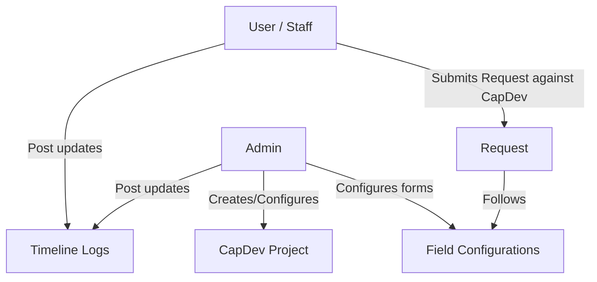

# LEAPRS System Concept & Core Workflow

This document explains the conceptual architecture and functional flows of the **Lifelong Education Advancement Program Requisition System (LEAPRS)**.
It describes the current implementation; distinguish live features from sample or placeholder data when using it as a system reference.

---

## 1. System Overview

LEAPRS is designed to manage Capacity Development projects (CapDev), employee requests (requisitions) associated with those projects, and status timelines of individual requests.

---

## 2. Core Entities

### A. CapDev (Capacity Development)
A CapDev is a parent project or educational program.
* **Fixed Fields (In Codebase)**:
  * `AIP Code` (Unique project code)
  * **UI Identifier**: Always display and reference a CapDev by its `AIP Code`; never expose the internal database ID as the CapDev identifier in user-facing UI, audit history, notifications, or reports.
  * `Description` (Project description)
  * `Initial Budget` (Original project fund)
  * `Remaining Budget` (`budget` column: available project fund after deductions)
  * `Department` (Owner department)
  * Fixed fields shown in the form preview remain interactive, but their layout is not configurable: they cannot be edited, deleted, or dragged.
* **Dynamic Fields (Configurable by Admin)**:
  * Custom tags, target audience, and other configured information.
  * Stored in `additional_info` JSONB column.
  * Fields marked `isRequired = true` are displayed in the **Required Information** section with fixed required fields and must be completed before a project can be created or updated. Other configured fields are displayed in the **Optional Information** section.
  * Dynamic fields remain fully configurable—including edit, delete, width toggling (full/half), and drag-and-drop reordering.

### B. Requests
Requisitions filed by employees against a specific CapDev.
* **Fixed Fields (In Codebase)**:
  * `Setting` (Internal or External)
  * `Description` (Request title or activity description)
  * `Requested Budget` (Cost estimation)
  * `Requestor Name` (Display name of the submitting user)
  * Fixed fields shown in the form preview remain interactive, but their layout is not configurable: they cannot be edited, deleted, or dragged.
* **Dynamic Fields (Configurable by Admin)**:
  * Attendance sheets (file type), feedback links, venue details, etc.
  * Stored in `additional_info` JSONB column.
  * Fields marked `isRequired = true` are grouped in the required section, while optional fields appear in optional sections.
  * Dynamic fields remain fully configurable—including edit, delete, width toggling, and drag-and-drop reordering.
* **Google Drive Folder ID**:
  * Stored in `additional_info.googleDriveFolderId`.

### C. Status Updates (Timeline)
Chronological logs track request progression. Status updates are **fixed** (not dynamic) and consist of:
* Status update text
* Remarks
* Multi-file uploads (via Google Drive integration)
* `status_mark` (`pending`, `completed`, or `denied`) is selected in the ordinary **Add Status** form. The database column is nullable because special timeline entries (stoppers, stopper responses, resume logs) do not use an ordinary status mark. A mark describes that step and does not by itself close or deny the whole request.
* `mark_as_complete` (legacy boolean column; the current Add Status form does not expose it or set it)
* `subtracts_requested_amount` (boolean with configurable deduction amount modal)
* `is_stopper`, `is_stopper_response`, `is_resume`, and `stopper_id` for blocker tracking.

---

## 3. Key Business Constraints & Logic

### A. One-Time Timeline Flags & Budget Deduction
* **Request Completion**: The current UI concludes a request through the explicit **Complete** or **Deny** resolution action, which updates the request's overall status (`in_progress`, `completed`, `denied`). Ordinary status marks do not conclude it. Once concluded, the server blocks further ordinary status updates.
* **Budget Deduction**: Once a status update has `subtracts_requested_amount = true`, the deduction modal opens allowing the user to review/edit the amount deducted before it is subtracted from the parent CapDev's balance. Only one status update per request can trigger this deduction.
* **Budget Availability**: A request's requested budget cannot exceed its parent CapDev's remaining budget. The same check is enforced again when a deduction status update is saved.
* **Budget History**: A CapDev stores its initial and remaining budgets. Its details view lists every deducted request amount and the status-update author.
* **Enforcement**: PostgreSQL partial unique indexes prevent duplicate `subtracts_requested_amount` status updates (`unique_request_subtract_idx`) and duplicate legacy `mark_as_complete` status updates (`unique_request_complete_idx`).

### B. File Uploads & Google Drive Storage Hierarchy
Google Drive is the durable file store; Vercel and the database do not store attachment bytes.

* **Folder Hierarchy**:
  * **Per-Request Dedicated Folders**: When files are uploaded for a request (e.g. dynamic file fields during request creation, multimodal AI request intake, status timeline attachments, and stoppers/stopper responses), the system creates a dedicated Google Drive folder named `[RequestorName]_[DateRequested]` (sanitized, e.g. `Jane Doe_2026-09-17`) located inside `GOOGLE_DRIVE_PARENT_FOLDER_ID`.
  * **Folder Persistence & Reuse**: The generated folder ID is cached and saved into the request's `additional_info.googleDriveFolderId`. All subsequent uploads for that request (all file inputs during creation, subsequent status updates, stoppers, and stopper responses) are placed into this same dedicated folder.
  * **Outside Request Context (Root Child)**: If an upload is performed outside a request context (such as CapDev project attachments or when no requestor/date/requestId context is provided), files are placed directly as children of `GOOGLE_DRIVE_PARENT_FOLDER_ID`.
  * **Cascade Folder Deletion**: When a request is deleted, its dedicated Google Drive folder (and all files contained within it) is automatically deleted from Google Drive via the Drive API before database records are deleted.
* **Database Reference**: Persist only Drive metadata (`id`, `name`, `mimeType`, and `url`) in the relevant JSONB value, including the `files` column of a status update and `additional_info` of requests/CapDev.
* **Upload Pathways**:
  * **Direct Resumable Upload (Primary)**: The active browser workflow requests Google Drive resumable-upload sessions (`createGoogleDriveUploadSessions`) with origin verification from the authenticated server, then PUTs file bytes directly to Google Drive via `uploadFilesDirectlyToGoogleDrive`.
  * **Server Action Upload (Fallback)**: `uploadFilesToGoogleDrive` server action handles multipart form upload through the server when needed.
* **Limits**: A single attachment selection supports at most 10 files whose combined size is **100 MB or less**.
* **Execution Model**: Uploads run as part of the active client workflow. LEAPRS does not require Redis, a message queue, or a long-running background worker for Drive uploads.

### C. Form Configuration & Custom Layouts
* Admins can configure the forms for CapDev and Requests.
* Dynamic field types supported: `text` (combobox: dropdown + text entry), `number`, `date` (datepicker), `select`, `file` (drag & drop upload), and `table` (editable grid). Table fields occupy a full row.
* Dynamic fields support full-width or half-width layout. An unpaired half-width field can occupy either the left or right column (`columnPosition: 'left' | 'right'`). Field order and column position persist in both configuration preview and operational forms.
* Adding/editing a field is a client-side draft operation. The bottom-right **Save Configuration** action is the explicit persistence point for staged additions, edits, and reordering.

### D. Cascading Entity Deletions
* **CapDev Deletion**: Automatically removes child requests, status updates, notifications, and notification reads in the same operation.
* **Request Deletion**: Automatically deletes its dedicated Google Drive folder via Drive API, child status updates, notifications, and notification reads, and records an immutable audit log entry.
* Never block parent deletion due to existing child history logs.

### E. Request Status vs. Status Update Marks
* **Whole Request Statuses**: `in_progress`, `completed`, `denied`.
* **Individual Status Update Marks**: The ordinary UI offers `pending`, `completed`, and `denied` (with legacy support for `accepted`).
* Marking a status update as `denied` or `completed` documents that specific milestone without terminating or overriding the overarching request timeline. Only explicit concluding actions (**Complete** or **Deny** resolution) finalize the request.

### F. Post-Completion Seminar Evaluation
* Upon concluding a request as **Completed**, LEAPRS creates and publishes **one seminar evaluation Google Form** for that request.
* The form contains sections for Guest Speaker, Learnings and Content, Overall Satisfaction, Comments and Suggestions, and Skills or Training Areas. It includes 1-to-5 ratings and written questions.
* The form ID and responder link are stored in `participant_feedback_form_id` and `participant_feedback_form_url`.
* The completion modal and final timeline card show **Open Form**, **Edit Form**, link-copy action, and **See Summary**.
* **See Summary** fetches current responses on demand. Rating distributions and averages are calculated from Google Forms responses. Groq AI generates strengths, improvements, and recommendations from written answers when configured; rating charts remain available if AI summarization fails.

---

## 4. Access, Registration, and Departments

The shared authenticated workspace uses the role-neutral `/portal` route. Access to pages and actions within the portal is determined by the signed-in user's role.

### A. Roles & Permissions

LEAPRS defines 5 distinct application roles:
* **Admin (`admin`)**: Full access. Manages users, role approvals, form configurations, CapDev projects, requests, maintenance mode, and audit logs.
* **Employee (`employee`)**: Can view all CapDev projects, but can create, edit, delete, and post status updates only on their own requests.
* **Employee (All Department Requests) (`employee-department`)**: Cross-department request management role. Can view all CapDev projects, manage all employees' requests across departments, post timeline updates, and control stoppers across the system.
* **Viewer (`viewer`)**: Read-only access to CapDev projects and requests within their assigned department.
* **Viewer (All Departments) (`viewer-full`)**: Read-only access across all departments.

### Notification Involvement

Notifications are event records, visible only while their associated CapDev/request still exists and only to involved users. An actor never receives a notification for their own action.
* **Admin**: Receives new-request and request-status activity across all departments.
* **Employee**: Receives status activity posted by someone else on requests they own.
* **Employee (All Department Requests)**: Receives new-request and request-status activity across all departments.
* **Viewer**: Receives CapDev, request, and status activity in their department.
* **Viewer (All Departments)**: Receives CapDev, request, and status activity across all departments.
* Notification reads are tracked per user via `notification_reads`.
* Clicking a notification marks it read and routes to its associated record with a highlighted pulsing card.

### B. Self-Registration & Role Approvals

* The login page supports self-registration with full name, email, password, role, and department.
* **Email Verification**: Registration enforces two-step email verification. Entering details dispatches a 6-digit verification code to the applicant's email (valid for 15 minutes) via Resend. The user must confirm this verification code before the account is created in Neon Auth and the database.
* Self-registration offers **Employee**, **Employee (All Department Requests)**, **Viewer**, and **Viewer (All Departments)**. Admin is assignable only through Users Management.
* Registrations for Employee, Viewer, and Viewer (All Departments) receive their role and profile immediately after email code verification.
* Registrations for **Employee (All Department Requests)** create a pending record in `role_approval_requests` after email code verification. Admins receive a notification linking to Users Management to accept or reject the request. Acceptance creates the user profile with the requested role; rejection deletes the pending auth account.
* Password validation enforces **8 to 128 characters** with specific error messaging.

### C. Shared Department Values
* Department is a fixed important field, not a configurable dynamic field.
* Department inputs use a shared combobox populated from previously saved user profiles and CapDev projects, with a **Not listed (please specify)** option to enter new departments.
* Admins may hide or restore department suggestions in CapDev form configuration.

### D. Maintenance Mode
* Maintenance mode is a persistent system setting (`system_settings.maintenance_mode`) toggled by an **Admin** from Portal Settings.
* While active, Admins retain full access. All other roles are denied sign-in and existing non-Admin sessions lose portal and server action access immediately.

### E. Dynamic Field Storage Identity
* Dynamic form values are stored in `additional_info` JSONB keyed by the field definition's stable database ID (`field-${id}` or `field:${id}`), never by its editable display label.
* A legacy label-key fallback is maintained for records created prior to stable field IDs.

### F. Audit History
* The application records immutable actor and record snapshots in `audit_logs` for user, CapDev, request, status-update, form-configuration, and maintenance actions.
* Audit records persist after related business records or users are deleted.
* Accessible only to Admins via a searchable, paginated audit log interface referencing readable identifiers (e.g. AIP Code).

---

## 5. Stopper and Resume Workflow

* An **Admin** or **Employee (All Department Requests)** can add a stopper (`is_stopper = true`) to an in-progress request with a reason and optional attachments.
* A stopper is retained on the timeline with a **Stopped** badge, a pin visual, its reason, and attachments.
* While stopped, regular Employees cannot post ordinary status updates. Instead, the active stopper card provides a response area for the employee to submit a stopper response (`is_stopper_response = true`) with text and attachments.
* Admin and Employee (All Department Requests) see **Resume Progress** (`is_resume = true`), which clears the active stopper and re-enables normal status updates.

---

## 6. Timeline Navigation and AI-Assisted Workflows

* The interactive progress bar in the request-status header mirrors timeline milestones and links directly to timeline updates, stoppers, or final resolution cards.
* **Portal AI Help Chatbot**:
  * Accessible from the portal header robot icon to all authenticated roles.
  * Powered by Gemini (e.g. `gemini-2.5-flash`), with grounded read-only tool calling (`get_request_status`, `get_my_requests_summary`, `get_department_budget_balance`, `list_available_capdev_projects`, `find_capdev_by_aip_code`, `get_request_form_schema`).
* **Multimodal Activity Design Intake**:
  * Users can upload or paste (Ctrl+V) activity design images, posters, screenshots, or PDFs into the chat.
  * Multimodal Gemini extracts requisition fields (AIP Code, setting, budget, description, dynamic fields) against the active form schema into a structured draft.
  * Users review, adjust, and confirm the draft in an editable modal before creating the request.
* **MCP OAuth Endpoint**:
  * Exposes `/api/mcp` and `/api/mcp/oauth/*` endpoints for external MCP clients.
  * Enforces role, department, and maintenance mode restrictions for external agent tool calls.

---

## 7. CapDev Uniqueness

* `AIP Code` is unique across CapDev projects. Creation performs a pre-check, backed by the PostgreSQL unique constraint on `capdevs.aip_code`.
* Conflicts are reported with specific business error messages naming the conflicting AIP Code in an action-error modal.

---

## 8. Analytics and Reports

* Admins and Viewers can view CapDev and request analytics and export an Excel monitoring workbook (`.xlsx`) generated via ExcelJS from live database records and dynamic field values.
* Department Viewers see only their department data; Admin and Viewer (All Departments) see all departments.
* Analytics charts reflect live database metrics for budget distribution, request statuses, and departmental utilization.

---

## 9. Data and Deployment Boundaries

* **Database**: Neon Postgres accessed via Drizzle ORM (`DATABASE_URL`).
* **Authentication**: Neon Auth (`NEON_AUTH_BASE_URL`, `NEON_AUTH_COOKIE_SECRET`) with custom user metadata and role approval tables.
* **File Storage**: Google Drive API (OAuth 2.0 refresh token) with dedicated request folders (`[RequestorName]_[DateRequested]`) and root fallback for non-request files.
* **AI Services**: Google Gemini API for portal chatbot and multimodal activity design intake; Groq API for post-completion evaluation summary generation.
* **Forms & Reporting**: Google Forms API for seminar evaluations; ExcelJS for Excel monitoring workbook generation.

