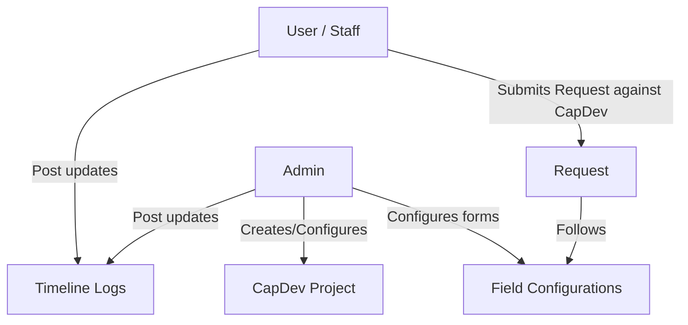

# LEAPRS System Concept & Core Workflow

This document explains the conceptual architecture and functional flows of the **Lifelong Education Advancement Program Requisition System (LEAPRS)**.

---

## 1. System Overview

LEAPRS is designed to manage capacity/capital development projects (CapDev), employee requests (requisitions) associated with those projects, and status timelines of individual requests.

---

## 2. Core Entities

### A. CapDev (Capital/Capacity Development)
A CapDev is a parent project or educational program.
* **Fixed Fields (In Codebase)**:
  * `AIP Code` (Unique project code)
  * **UI Identifier**: Always display and reference a CapDev by its `AIP Code`; never expose the internal database ID as the CapDev identifier in user-facing UI, audit history, notifications, or reports.
  * `Initial Budget` (Original project fund)
  * `Remaining Budget` (Available project fund after deductions)
  * `Department` (Owner department)
  * Fixed fields remain interactive in the form preview, but their layout is not configurable: they cannot be edited, deleted, or dragged.
* **Dynamic Fields (Configurable by Admin)**:
  * Custom description, tags, target audience, etc.
  * Stored in `additional_info` JSONB column.
  * Fields configured in the `required` section are displayed with the fixed Required Information fields and must be completed before a project can be created or updated. Other configured fields are grouped under the exact section names configured by the admin; do not collapse them into a generic additional-information section.
  * Dynamic fields remain fully configurable—including edit, delete, and drag-and-drop—regardless of whether they are placed in the `required` section or any other section.

### B. Requests
Requisitions filed by employees against a specific CapDev.
* **Fixed Fields (In Codebase)**:
  * `Setting` (Internal or External)
  * `Requested Budget` (Cost estimation)
  * Fixed fields remain interactive in the form preview, but their layout is not configurable: they cannot be edited, deleted, or dragged.
* **Dynamic Fields (Configurable by Admin)**:
  * Attendance sheets (file type), feedback links, etc.
  * Stored in `additional_info` JSONB column.
  * Dynamic fields remain fully configurable—including edit, delete, and drag-and-drop—regardless of whether they are placed in the `required` section or any other section.

### C. Status Updates (Timeline)
Chronological logs track request progression. Status updates are **fixed** (not dynamic) and consist of:
* Status update text
* Remarks
* Multi-file uploads (via Google Drive integration)
* `status_mark` (required enum: `pending`, `completed`, `denied`). Setting a status mark on an individual status update indicates the status of that specific step and does *not* prematurely close or deny the entire request timeline.
* `mark_as_complete` (boolean)
* `subtracts_requested_amount` (boolean with configurable deduction amount modal)

---

## 3. Key Business Constraints & Logic

### A. One-Time Timeline Flags
* **Timeline Completion**: Once a status update has `mark_as_complete = true` or the request is concluded as Completed via timeline resolution, the request is finished. No further updates are permitted.
* **Budget Deduction**: Once a status update has `subtracts_requested_amount = true`, the deduction modal opens allowing the user to review/edit the amount deducted before it is subtracted from the parent CapDev's balance. Only one status update per request can trigger this deduction.
* **Budget Availability**: A request's requested budget cannot exceed its parent CapDev's remaining budget. The same check is enforced again when a deduction status update is saved.
* **Budget History**: A CapDev stores its initial and remaining budgets. Its details view lists every deducted request amount and the status-update author.
* *Enforcement*: Enforced via PostgreSQL partial unique indexes to block concurrency race conditions.

### B. File Uploads (Google Drive)
All files are uploaded to Google Drive.
* **Folder Naming Structure**: `[Username] - [Date Submitted] - [Request Name]`
* **Database Reference**: Array of JSON objects stored in the `files` JSONB column of the status update.

### C. Form Configuration & Custom Layouts
* Admins can configure the forms for CapDev and Requests.
* Dynamic field types supported: `text` (combobox: dropdown + text entry), `number`, `date` (datepicker), `file` (drag & drop upload).

### D. Cascading Entity Deletions
* **Allow Delete & Cascade Children**: When deleting any parent entity (such as a CapDev project or a Requisition request), the system must permit deletion by automatically removing all attached foreign-key child records (e.g., status updates, timeline logs, and sub-references) in the same operation. Never block parent deletion due to existing child history logs.

### E. Request Status vs. Status Update Marks
* **Whole Request Statuses**: `in_progress`, `completed`, `denied`.
* **Individual Status Update Marks**: `pending`, `completed`, `denied`.
* Marking a status update as `denied` or `completed` documents that specific milestone without terminating or overriding the overarching request timeline. Only explicit concluding actions (`Complete` or `Deny` resolution) finalize the request.

### F. Post-Completion Training Feedback & Evaluation Google Forms
* Upon concluding a request as **Completed**, the system generates links to two Google Forms for feedback and post-training evaluation:
  1. **Participant Evaluation & Feedback Form**: For participants/attendees to rate training content, trainer delivery, and logistics (`https://forms.gle/c8BjUUoPxYWiBxnF8`).
  2. **Supervisor / Post-Activity Evaluation Form**: For supervisors and coordinators to assess workplace application, action plans, and skill improvements (`https://forms.gle/c8BjUUoPxYWiBxnF8`).
* The forms are presented via a celebratory completion modal dialog immediately upon completion, and persist in the timeline's final resolution card with direct **Open Form** and **Copy Link** actions.

## 4. Access, Registration, and Departments

### A. Roles

* **Admin** manages users, configuration, CapDev projects, and requests.
* **Employee** can view CapDev projects and create, update, and delete only their own requests.
* **Employee (Department Requests)** is an admin-assigned department assistant role. It can view and manage requests belonging to CapDev projects in its department, including other employees' requests, and can post timeline updates.
* **Viewer** has read-only access to CapDev projects and requests in its department.
* **Viewer (All Departments)** has read-only access across departments.

### B. Self-Registration

* The login page supports Neon Auth email registration with full name, email, password, role, and department.
* Self-registration offers only **Employee**, **Viewer**, and **Viewer (All Departments)**. Admin and Employee (Department Requests) are assigned only through Users Management.
* A newly registered account receives its selected application role and department immediately after Neon Auth creates the account.

### C. Shared Department Values

* Department is a fixed important field, not a configurable dynamic field.
* Department inputs in CapDev CRUD, signup, and Users Management are free-text comboboxes. Users can select a previously used department or type a new one.
* The shared suggestion list is read from saved user profiles and CapDev projects. Saving a new department value makes it available as a future suggestion; departments intentionally have create/read behavior only, with no separate update or delete screen.

## 5. Stopper and Resume Workflow

* An **Admin** or **Employee (Department Requests)** can add a stopper at any time by supplying a reason and optional attachments. A request may be stopped again after it has been resumed.
* A stopper is retained as a timeline card with a **Stopped** badge, a pin visual, its reason, and its attachments. It remains in the history after resumption and shows that it was resumed.
* While a request is stopped, normal Employees cannot add ordinary status updates. Instead, the active stopper card provides them a text and attachment response area so they can submit what the stopper reason asks for.
* While stopped, Admin and Employee (Department Requests) see **Resume Progress** in place of adding a status update. Resuming re-enables normal Employee status updates.
* Server authorization enforces these rules: regular Employees can submit only a response to the active stopper on their own request; only Admin and Employee (Department Requests) can stop or resume progress.
