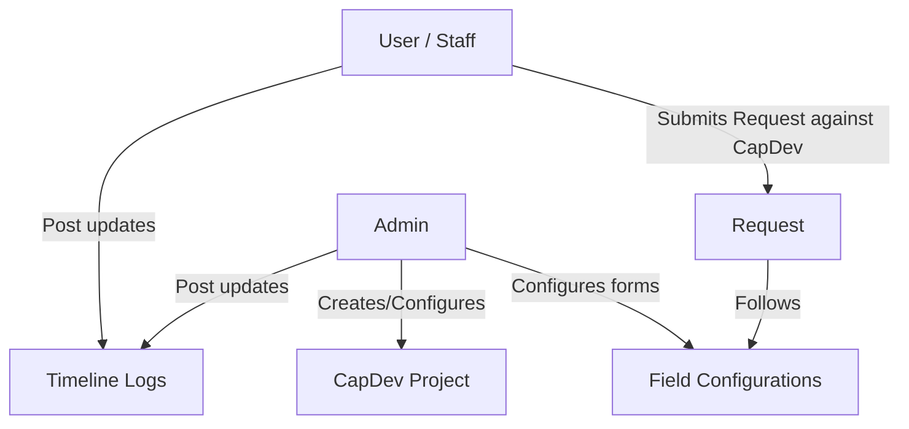

# LEAPRS System Concept & Core Workflow

This document explains the conceptual architecture and functional flows of the **Lifelong Education Advancement Program Requisition System (LEAPRS)**.

---

## 1. System Overview

LEAPRS is designed to manage capacity/capital development projects (CapDev), employee requests (requisitions) associated with those projects, and status timelines of individual requests.

---

## 2. Core Entities

### A. CapDev (Capital/Capacity Development)
A CapDev is a parent project or educational program.
* **Fixed Fields (In Codebase)**:
  * `AIP Code` (Unique project code)
  * `Budget` (Overall project fund)
  * `Department` (Owner department)
  * `Start Date` & `End Date`
  * Fixed fields remain interactive in the form preview, but their layout is not configurable: they cannot be edited, deleted, or dragged.
* **Dynamic Fields (Configurable by Admin)**:
  * Custom description, tags, target audience, etc.
  * Stored in `additional_info` JSONB column.
  * Fields configured in the `required` section are displayed with the fixed Required Information fields and must be completed before a project can be created or updated. Other configured fields are grouped under the exact section names configured by the admin; do not collapse them into a generic additional-information section.
  * Dynamic fields remain fully configurable—including edit, delete, and drag-and-drop—regardless of whether they are placed in the `required` section or any other section.

### B. Requests
Requisitions filed by employees against a specific CapDev.
* **Fixed Fields (In Codebase)**:
  * `Setting` (Internal or External)
  * `Requested Budget` (Cost estimation)
  * `Start Date` & `End Date`
  * Fixed fields remain interactive in the form preview, but their layout is not configurable: they cannot be edited, deleted, or dragged.
* **Dynamic Fields (Configurable by Admin)**:
  * Attendance sheets (file type), feedback links, etc.
  * Stored in `additional_info` JSONB column.
  * Dynamic fields remain fully configurable—including edit, delete, and drag-and-drop—regardless of whether they are placed in the `required` section or any other section.

### C. Status Updates (Timeline)
Chronological logs track request progression. Status updates are **fixed** (not dynamic) and consist of:
* Status update text
* Remarks
* Multi-file uploads (via Google Drive integration)
* `mark_as_complete` (boolean)
* `subtracts_requested_amount` (boolean)

---

## 3. Key Business Constraints & Logic

### A. One-Time Timeline Flags
* **Timeline Completion**: Once a status update has `mark_as_complete = true`, the request is finished. No further updates are permitted. Only one status update in a request's timeline can have this true.
* **Budget Deduction**: Once a status update has `subtracts_requested_amount = true`, the request budget is automatically deducted from the parent CapDev's overall budget. Only one status update per request can trigger this deduction.
* *Enforcement*: Enforced via PostgreSQL partial unique indexes to block concurrency race conditions.

### B. File Uploads (Google Drive)
All files are uploaded to Google Drive.
* **Folder Naming Structure**: `[Username] - [Date Submitted] - [Request Name]`
* **Database Reference**: Array of JSON objects stored in the `files` JSONB column of the status update.

### C. Form Configuration & Custom Layouts
* Admins can configure the forms for CapDev and Requests.
* Dynamic field types supported: `text` (combobox: dropdown + text entry), `number`, `date` (datepicker), `file` (drag & drop upload).
