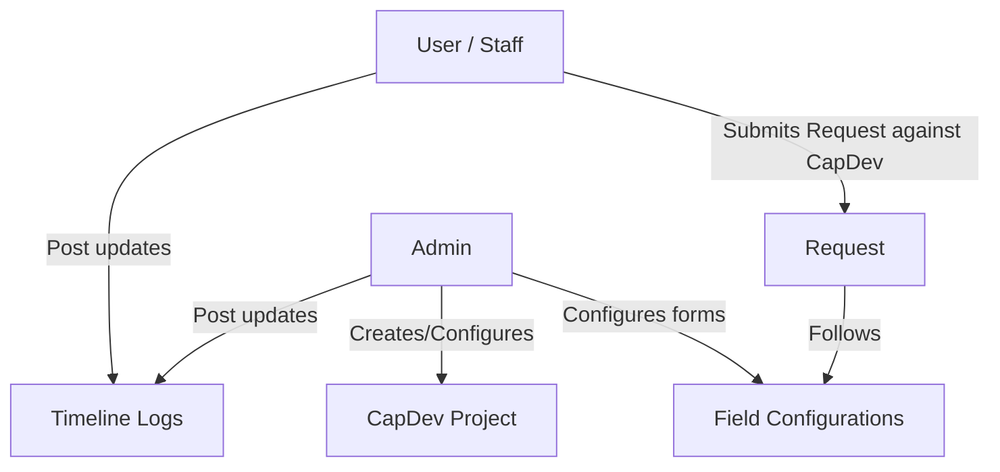

# LEAPRS System Concept & Core Workflow

This document explains the conceptual architecture and functional flows of the **Lifelong Education Advancement Program Requisition System (LEAPRS)**.

---

## 1. System Overview

LEAPRS is designed to manage capacity/capital development projects (CapDev), employee requests (requisitions) associated with those projects, and status timelines of individual requests.

---

## 2. Core Entities

### A. CapDev (Capital/Capacity Development)
A CapDev is a parent project or educational program.
* **Fixed Fields (In Codebase)**:
  * `AIP Code` (Unique project code)
  * **UI Identifier**: Always display and reference a CapDev by its `AIP Code`; never expose the internal database ID as the CapDev identifier in user-facing UI, audit history, notifications, or reports.
  * `Initial Budget` (Original project fund)
  * `Remaining Budget` (Available project fund after deductions)
  * `Department` (Owner department)
  * Fixed fields remain interactive in the form preview, but their layout is not configurable: they cannot be edited, deleted, or dragged.
* **Dynamic Fields (Configurable by Admin)**:
  * Custom description, tags, target audience, etc.
  * Stored in `additional_info` JSONB column.
  * Fields configured in the `required` section are displayed with the fixed Required Information fields and must be completed before a project can be created or updated. Other configured fields are grouped under the exact section names configured by the admin; do not collapse them into a generic additional-information section.
  * Dynamic fields remain fully configurable—including edit, delete, and drag-and-drop—regardless of whether they are placed in the `required` section or any other section.

### B. Requests
Requisitions filed by employees against a specific CapDev.
* **Fixed Fields (In Codebase)**:
  * `Setting` (Internal or External)
  * `Requested Budget` (Cost estimation)
  * Fixed fields remain interactive in the form preview, but their layout is not configurable: they cannot be edited, deleted, or dragged.
* **Dynamic Fields (Configurable by Admin)**:
  * Attendance sheets (file type), feedback links, etc.
  * Stored in `additional_info` JSONB column.
  * Dynamic fields remain fully configurable—including edit, delete, and drag-and-drop—regardless of whether they are placed in the `required` section or any other section.

### C. Status Updates (Timeline)
Chronological logs track request progression. Status updates are **fixed** (not dynamic) and consist of:
* Status update text
* Remarks
* Multi-file uploads (via Google Drive integration)
* `status_mark` (required enum: `pending`, `completed`, `denied`). Setting a status mark on an individual status update indicates the status of that specific step and does *not* prematurely close or deny the entire request timeline.
* `mark_as_complete` (boolean)
* `subtracts_requested_amount` (boolean with configurable deduction amount modal)

---

## 3. Key Business Constraints & Logic

### A. One-Time Timeline Flags
* **Timeline Completion**: Once a status update has `mark_as_complete = true` or the request is concluded as Completed via timeline resolution, the request is finished. No further updates are permitted.
* **Budget Deduction**: Once a status update has `subtracts_requested_amount = true`, the deduction modal opens allowing the user to review/edit the amount deducted before it is subtracted from the parent CapDev's balance. Only one status update per request can trigger this deduction.
* **Budget Availability**: A request's requested budget cannot exceed its parent CapDev's remaining budget. The same check is enforced again when a deduction status update is saved.
* **Budget History**: A CapDev stores its initial and remaining budgets. Its details view lists every deducted request amount and the status-update author.
* *Enforcement*: Enforced via PostgreSQL partial unique indexes to block concurrency race conditions.

### B. File Uploads (Google Drive)
Google Drive is the sole durable file store; Vercel and the database do not store attachment bytes.
* **Folder Naming Structure**: `[Username] - [Date Submitted] - [Request Name]`
* **Database Reference**: Persist only Drive metadata (`id`, `name`, `mimeType`, and `url`) in the relevant JSONB value, including the `files` column of a status update.
* **Upload Path**: The authenticated server creates short-lived Google Drive resumable-upload sessions from file metadata. The browser uploads the file bytes directly to each session URL, bypassing Vercel's request-body limit; the application must not proxy those bytes through a Vercel function.
* **Limits**: A single attachment selection supports at most 10 files whose combined size is **100 MB or less**.
* **Execution Model**: Uploads run as part of the active client workflow. LEAPRS does not require Redis, a message queue, or a long-running background worker for Drive uploads.
* **Failure Handling**: Save only the returned Drive metadata after upload succeeds. Return a specific failure reason when session preparation, Drive authorization, or an individual upload fails.

### C. Form Configuration & Custom Layouts
* Admins can configure the forms for CapDev and Requests.
* Dynamic field types supported: `text` (combobox: dropdown + text entry), `number`, `date` (datepicker), `file` (drag & drop upload).
* An unpaired half-width dynamic field can occupy either the left or right column. Dragging it into its adjacent empty half-slot changes and persists that column position in both the configuration preview and operational forms.
* Adding a field is a client-side draft operation. **Add Field** places the completed draft into the form preview without inserting it into the backend; the fixed bottom-right **Save Configuration** action is the explicit persistence point for staged additions and edits.

### D. Cascading Entity Deletions
* **Allow Delete & Cascade Children**: When deleting any parent entity (such as a CapDev project or a Requisition request), the system must permit deletion by automatically removing all attached foreign-key child records (e.g., status updates, timeline logs, and sub-references) in the same operation. Never block parent deletion due to existing child history logs.

### E. Request Status vs. Status Update Marks
* **Whole Request Statuses**: `in_progress`, `completed`, `denied`.
* **Individual Status Update Marks**: `pending`, `completed`, `denied`.
* Marking a status update as `denied` or `completed` documents that specific milestone without terminating or overriding the overarching request timeline. Only explicit concluding actions (`Complete` or `Deny` resolution) finalize the request.

### F. Post-Completion Training Feedback & Evaluation Google Forms
* Upon concluding a request as **Completed**, the system dynamically creates and publishes two Google Forms that are unique to that request and accept responses from anyone with the link:
  1. **Participant Evaluation & Feedback Form**: Ratings for overall satisfaction, content relevance, facilitator effectiveness, and logistics, plus written strengths, improvements, and comments.
  2. **Supervisor / Post-Activity Evaluation Form**: Ratings for job relevance, knowledge or skill improvement, workplace application, and overall value, plus observed changes, follow-up support, and comments.
* The generated form IDs and responder links are stored on the request. Retrying completion reuses any forms already stored instead of producing duplicates.
* Each form is presented in the completion modal and final timeline card with **Open Form**, **Copy Link**, and **See Summary** actions.
* **See Summary** fetches the latest responses on demand. Rating charts are calculated directly from response data; Gemini produces only the plain-language overview, strengths, improvements, and recommended actions. No webhook is required for this on-demand workflow.

## 4. Access, Registration, and Departments

The shared authenticated workspace uses the role-neutral `/portal` route. Access to pages and actions within the portal is determined by the signed-in user's role; the route name does not imply Admin access.

### A. Roles

* **Admin** manages users, configuration, CapDev projects, and requests.
* **Employee** can view CapDev projects and create, update, and delete only their own requests.
* **Employee (All Department Requests)** is a request-management role with access across all departments. It can view every CapDev project; view and manage all employees' requests; post timeline updates; and control stoppers across the system. Users may request this role during self-registration, but the LEAPRS account and role remain pending until an Admin accepts the request.
* **Viewer** has read-only access to CapDev projects and requests in its department.
* **Viewer (All Departments)** has read-only access across departments.

### Notification Involvement

Notifications are event records, but they are visible only while their associated CapDev/request still exists and only to involved users. An actor never receives a notification for their own action.

* **Admin** receives new-request and request-status activity across all departments.
* **Employee** receives status activity posted by someone else on requests they own. They do not receive general CapDev or unrelated request activity.
* **Employee (All Department Requests)** receives new-request and request-status activity across all departments.
* **Viewer** receives CapDev, request, and request-status activity in their department.
* **Viewer (All Departments)** receives CapDev, request, and request-status activity across all departments.
* Deleting an associated request or CapDev removes its notifications from every audience. Audit logs remain independent and persist.
* Clicking a notification marks it read and routes to its associated record. Target links use stable anchors for the exact CapDev card, request card, status update or stopper, final request resolution, or role-approval record.
* The destination page makes a target visible across filters and pagination, smoothly scrolls to its full record card, and briefly pulses that card. Only the record box is emphasized; titles and headings are never focus targets.
* A legacy status notification without a status-update anchor falls back to the associated request card rather than selecting an unrelated timeline update.

### B. Self-Registration

* The login page supports Neon Auth email registration with full name, email, password, role, and department.
* Self-registration offers **Employee**, **Employee (All Department Requests)**, **Viewer**, and **Viewer (All Departments)**. Admin remains assignable only through Users Management.
* Employee, Viewer, and Viewer (All Departments) accounts receive their selected application role and department immediately after Neon Auth creates the authentication record.
* Employee (All Department Requests) registrations create a pending role approval request instead of an application user profile. Admins receive a notification linking to Users Management, where they can accept or reject it. Acceptance creates the application user profile with the requested role and department; rejection removes the pending authentication account.
* New passwords and reset passwords must contain **8 to 128 characters**. Validation identifies only the failing condition: it reports the current length and required additions/removals, while password-confirmation mismatch is a separate error. The same length rule applies when an Admin creates a user.

### C. Shared Department Values

* Department is a fixed important field, not a configurable dynamic field.
* Department inputs in CapDev CRUD, signup, Users Management, and the CapDev form preview use a single combobox populated with previously saved departments. The final option is **Not listed (please specify)**; selecting it makes the same combobox editable for entering a new department.
* The shared suggestion list is read from saved user profiles and CapDev projects. Saving a new department value makes it available as a future suggestion; departments intentionally have create/read behavior only, with no separate update or delete screen.

### D. Maintenance Mode

* Maintenance mode is a persistent system setting that only an **Admin** can change from Portal Settings.
* While maintenance mode is active, Admins retain access so they can operate the system and turn maintenance mode off. Every other role is denied sign-in and shown a clear maintenance notice.
* Existing non-Admin sessions also lose portal and server-action access while maintenance mode is active; maintenance mode is not limited to new login attempts.

### E. Dynamic Field Storage Identity

* Dynamic form values are stored by the field definition's stable database ID, never by its editable display label. Fields with identical labels must remain independent in previews, CRUD forms, saved records, reports, and exports.
* Readers retain a legacy label-key fallback for records saved before stable field keys were introduced. Because an old label-keyed record cannot distinguish two same-label fields, both may initially show the legacy value until the fields are saved independently with stable keys.

## 5. Stopper and Resume Workflow

* An **Admin** or **Employee (All Department Requests)** can add a stopper at any time by supplying a reason and optional attachments. A request may be stopped again after it has been resumed.
* A stopper is retained as a timeline card with a **Stopped** badge, a pin visual, its reason, and its attachments. It remains in the history after resumption and shows that it was resumed.
* While a request is stopped, normal Employees cannot add ordinary status updates. Instead, the active stopper card provides them a text and attachment response area so they can submit what the stopper reason asks for.
* While stopped, Admin and Employee (All Department Requests) see **Resume Progress** in place of adding a status update. Resuming re-enables normal Employee status updates.
* Server authorization enforces these rules: regular Employees can submit only a response to the active stopper on their own request; only Admin and Employee (All Department Requests) can stop or resume progress.

## 6. Timeline Navigation and Shared Help

* The progress summary in the request-status header mirrors timeline events while omitting nested stopper responses and resume-log rows. It includes a final resolution node when the request is Completed or Denied.
* Every progress node targets its exact timeline update, stopper card, or final-resolution card. Selecting a node smoothly scrolls to and briefly pulses the whole destination card.
* The portal header exposes a friendly robot help chat to every authenticated role. It currently provides UI-only, deterministic guidance about CapDev projects, requests, attachments, status updates, and settings; it does not call an AI service or perform backend actions.

## 7. CapDev Uniqueness

* `AIP Code` is unique across CapDev projects. Creation performs a friendly pre-check, while the database unique constraint remains the concurrency-safe final authority.
* A duplicate is returned as a specific business error naming the conflicting AIP Code. The UI presents that failed save in an action-error modal instead of a top-of-form banner.
