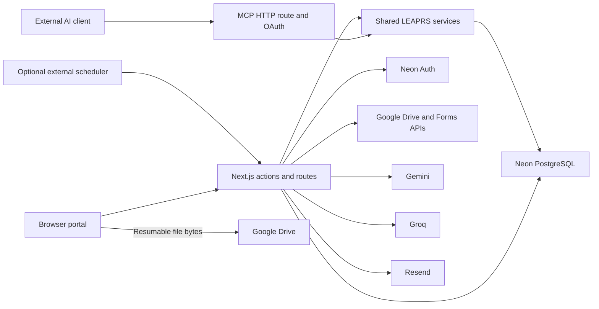

# LEAPRS Architecture

Reviewed against the workspace on October 10, 2026, including uncommitted background-upload changes. This document describes the current implementation, not verified production deployment. See [REQUIREMENTS.md](REQUIREMENTS.md) for business rules and [DESIGN_SYSTEM.md](DESIGN_SYSTEM.md) for UI standards. The [project guidance skill](.agents/skills/leaprs-project-guidance/SKILL.md) directs coding agents to these documents when relevant.

## 1. Components and boundaries

LEAPRS is a Next.js App Router application deployed to Vercel, with React/MUI client screens, authenticated server actions, and Node.js API routes. The installed versions in [package.json](package.json) are Next.js 16.3.2 and React 19.2.8; use Node.js 22.15 or newer.



- Browser code owns interactive forms, local file objects, and the attachment transfer queue.
- Next.js owns authorization, validation, database writes, Drive session preparation/finalization, notification processing, and AI provider calls.
- PostgreSQL stores business records, form definitions, grants, audit history, rate limits, and email delivery jobs. It stores attachment metadata, not file bytes.
- Neon Auth stores authentication identities and sessions; application roles/departments live in the application `users` table.
- Google Drive is durable attachment storage. Forms stores evaluation questions/responses. AI and email providers are external services.
- There is no Redis, Kafka, service-worker upload pipeline, or continuously running queue process in this implementation.

## 2. Source map

| Area | Main sources |
| --- | --- |
| Portal authentication/header/provider lifetime | [portal/layout.tsx](src/app/portal/layout.tsx), [auth/server.ts](src/lib/auth/server.ts), [auth/client.ts](src/lib/auth/client.ts) |
| Forms, administration, workflow actions | [actions.ts](src/app/actions.ts), `src/app/portal/` |
| Shared request and tool services | [leaprs-service.ts](src/lib/services/leaprs-service.ts) |
| Schema / queries / transactions | [schema.ts](src/db/schema.ts), [db/index.ts](src/db/index.ts), [transaction.ts](src/db/transaction.ts) |
| Budget / archive / deletion | [request-budget.ts](src/lib/request-budget.ts), [archive-policy.ts](src/lib/archive-policy.ts), [request-deletion.ts](src/lib/request-deletion.ts) |
| Dynamic field identity/validation | [dynamic-fields.ts](src/lib/dynamic-fields.ts), [request-validation.ts](src/lib/request-validation.ts) |
| Background file jobs and metadata | [background-upload-queue.ts](src/lib/background-upload-queue.ts), [background-attachments.ts](src/lib/background-attachments.ts), [BackgroundUploads.tsx](src/components/BackgroundUploads.tsx) |
| Trusted folders and older upload helper | [request-storage.ts](src/lib/request-storage.ts), [google-drive-client.ts](src/lib/google-drive-client.ts) |
| Notifications / email / reminders | [notification-audience.ts](src/lib/notification-audience.ts), [notification-email.ts](src/lib/notification-email.ts), [request-reminders.ts](src/lib/request-reminders.ts) |
| MCP transport / OAuth | [mcp/route.ts](src/app/api/mcp/route.ts), [mcp/server.ts](src/lib/mcp/server.ts), [mcp/oauth.ts](src/lib/mcp/oauth.ts), [client-registration.ts](src/lib/mcp/client-registration.ts) |
| AI help and setup guide | [PortalChatbot.tsx](src/components/PortalChatbot.tsx), [ConnectAiAppsDialog.tsx](src/components/ConnectAiAppsDialog.tsx), [ai-app-guides.ts](src/lib/ai-app-guides.ts) |
| Evaluation / reporting | [google-forms.ts](src/lib/google-forms.ts), [analytics-metrics.ts](src/lib/analytics-metrics.ts), report actions in `actions.ts` |
| Presentation | [ThemeRegistry.tsx](src/theme/ThemeRegistry.tsx), [Skeletons.tsx](src/components/Skeletons.tsx) |

## 3. Data model

| Tables | Responsibility |
| --- | --- |
| `users` + `neon_auth.user` | Application role, department, archive state; authentication name/email/credentials |
| `capdevs` | Unique AIP Code, initial/remaining budgets, department, configured JSON values |
| `requests` | Parent/owner, requestor name, setting, amount, workflow/stopper state, permanent deduction marker, form links, configured JSON |
| `request_status_updates` | Progress, author snapshot, marks, deduction flag, stopper/response/resume relations, attachments, configured JSON |
| `capdev_field_definitions`, `request_field_definitions`, `status_update_field_definitions` | Dynamic form schema, options, required/active state, layout/order |
| `request_storage_folders` | Server-controlled folder ownership/root and request binding |
| `system_settings` | Maintenance switch, numeric inactivity threshold, and other stored settings |
| `role_approval_requests` | Pending/accepted/rejected elevated role requests |
| `signup_verifications`, `password_resets`, `security_rate_limits` | Verification hashes, expiry, shared counters |
| `notifications`, `notification_reads` | Event record and per-user read state |
| `email_notification_preferences`, `notification_email_deliveries` | Per-user type opt-ins and durable per-recipient delivery state |
| `mcp_oauth_clients`, `mcp_oauth_grants` | DCR registrations and hashed code/access/refresh credentials |
| `audit_logs` | Immutable actor/entity snapshots and change details |

The schema also retains a connection-check table and legacy columns, including supervisor evaluation links, status-update archive flags, and legacy completion marks. Retaining a column does not imply an active UI workflow.

Dynamic values use the canonical key `field:<definition id>` in `additional_info`. `getDynamicFieldValue` falls back to the old field label when a canonical key is absent. The current helper does not implement a general `field-<id>` fallback. Request form definitions include `setting` to separate In-House and External schemas.

Requests and timeline entries keep numeric IDs for joins/routes. Requestor name is a display identifier, not a uniqueness constraint. Budget columns use PostgreSQL numeric values with two decimal places.

## 4. Authentication, authorization, and validation

- Neon Auth's Next.js handler serves `/api/auth/[...path]`. The sign-up wrapper additionally enforces the allowed email domain at the sign-up endpoint.
- Server actions resolve the current authenticated identity and current application role/department. Archived accounts and non-Admin access during maintenance fail authorization.
- Portal read/mutation helpers check project department, request ownership, role, and archive state. The shared tool services also enforce access. Role labels shown by the client are not authorization evidence.
- `validateRequestInput` allowlists request fields and rejects unsupported settings, invalid amounts, oversized description/JSON, and caller-supplied identity/workflow state. Suggestions-only combobox values are validated against definition options.
- Verification codes use keyed hashes based on purpose/email and `NEON_AUTH_COOKIE_SECRET`; rate-limit counters are PostgreSQL rows shared across instances.
- Forwarded IP/host checks depend on a deployment proxy that overwrites client-supplied forwarded headers. Database credentials, API keys, OAuth refresh credentials, and cookie secrets remain server-side.
- MCP bearer authorization is a separate grant from a browser session. Live role, department, archive, and maintenance state is reloaded for each call; logging out of the portal does not revoke those grants.

## 5. Database transactions and external effects

Ordinary reads/simple statements use Drizzle's Neon HTTP adapter. Multi-statement workflows use `withTransaction`, which creates a Neon WebSocket Pool scoped to that transaction and closes it in `finally`.

- Deduction locks the request and its CapDev, verifies eligibility/previous deduction, conditionally subtracts only if enough balance remains, records `budget_deducted_at`, and inserts the timeline entry in the same transaction.
- Partial unique indexes prevent duplicate deduction and legacy completion entries. The permanent request marker prevents a removed deduction entry from enabling another deduction.
- Stop/resume, archive/restore, permanent deletion, folder claims, and attachment finalization use locks for their related invariants. Request workflows generally lock the request before the parent and timeline entry.
- Attachment completion merges only the matching pending descriptor. Updating a form reconciles a stale pending token to its completed attachment before writing.
- CapDev/request creation, role-approval registration, request resolution, stop/resume, timeline updates and AI submission insert their notification event inside the business transaction using `insertNotificationEvent`. Insert failures roll back business writes and deductions. Email processing is scheduled after commit and can reconstruct delivery jobs from saved events. Audit logging and external provider effects remain separate.
- External Drive/Form API calls cannot be rolled back with PostgreSQL. Request folder deletion failures are logged while database deletion continues. Form creation during resolution can produce an external form even if a later database step fails.

Do not describe all database/provider effects as one atomic transaction.

## 6. Background attachment pipeline

### Save first, transfer second

```mermaid
sequenceDiagram
    participant B as Browser form/queue
    participant S as Server actions
    participant P as PostgreSQL
    participant D as Google Drive
    B->>S: Save fields and pending descriptors
    S->>P: Persist authorized record
    S-->>B: Saved record ID
    Note over B: Close form; enqueue local File jobs
    B->>S: Prepare attachment session
    S->>P: Check record and pending uploader
    S->>D: Create resumable session in managed folder
    S-->>B: Session URL
    B->>D: PUT file bytes with progress
    D-->>B: Drive file ID
    B->>S: Finalize attachment
    S->>D: Fetch authoritative file metadata
    S->>P: Lock and replace pending descriptor
    S-->>B: Attachment saved
    Note over B: Notify open views to refresh
```

`stageAttachments` produces pending descriptors and local jobs before saving. A descriptor contains `pendingUploadId`, `pending`, `name`, `mimeType`, and `size`; the server records uploader identity. A job additionally contains the `File`, target kind/ID, field key, state, progress, attempt count, and reusable Drive session/file identifiers.

The account-keyed BackgroundUploads provider lives in the portal layout, keeping its queue through client-side portal navigation. Jobs persist in device IndexedDB, partitioned by account; a Web Lock serializes processing across tabs for that account. Saved pending names remain visible to other authorized readers, but those readers cannot monitor the uploader's queue.

### Transfers and retries

- Queue states are `pending`, `uploading`, `failed`, `completed`, and `cancelled`. One transport runs at a time.
- Each job gets up to three attempts with 1-second then 2-second delays. Manual Retry resets attempts for that job without resaving the business record.
- The server prepares a resumable Drive URL using server-held Google credentials. Browser XMLHttpRequest PUT transfers bytes directly to Drive and reports upload progress; the transfer has a ten-minute timeout.
- Retry probes an existing session with `Content-Range`. It can resume from Drive's acknowledged offset or recover the final file ID after a lost response. An expired session is cleared for preparation on a subsequent attempt.
- Once a Drive file ID is known, metadata-finalization retries reuse it rather than uploading bytes again. Completed jobs release their file bytes.
- Progress is capped at 99% until finalization succeeds. Completion dispatches `leaprs-attachments-updated`; subscribed pages reload and the router refreshes.
- Hide only changes presentation. Both panel and icon render only while an unfinished job exists; failures count as unfinished. The queue still retains completed job metadata in memory.

### Completion checks and storage

`prepareBackgroundAttachment` checks the live account, record permissions, archive state, pending uploader, and upload origin. It creates Drive app properties binding the upload token, record kind/ID, and uploader ID.

`finishBackgroundAttachment` fetches metadata from Drive and verifies those properties, trash state, expected name/size, and parent folder. Under row locks it replaces only the matching pending marker. Status uploads also update the status `files` list and preserve the parent request's folder reference. Repeated completion with an already attached file is harmless.

Request folders are named from requestor/date and recorded in `request_storage_folders`. `additional_info.googleDriveFolderId` supports existing UI consumers but is not trusted independently for claims or deletion. CapDev attachments are direct children of the configured root. Existing direct/resumable helpers and a server multipart fallback remain available; the new portal forms use the shared background path.

### Persistence and recovery

`upload-storage.ts` stores selected Files and resumable job checkpoints in IndexedDB, keyed by account and upload token. `BackgroundUploadQueue` restores unfinished jobs and uses a per-account Web Lock for exclusive processing. Uploading jobs resume as pending; failed jobs retain their Retry action. Completion retains a small tombstone and releases file bytes, preventing duplicate processing by another tab.

`reconcileBackgroundAttachment` verifies live permissions and saved descriptors before transfer. It recognizes completed tokens, recovers tagged Drive file IDs after lost responses, and cancels jobs whose records/attachments were removed. Cleanup only deletes unused Drive files tagged for that exact account, record and token. Archived or inaccessible records fail safely without deleting their files. Cleanup runs during recovery/retry; there is no unattended Drive sweeper.

Transfers pause while the browser is closed or signed out and resume when the same account reopens this browser. Clearing IndexedDB, storage eviction, changing devices or unsupported storage/Web Locks require recovery through file re-selection or a supported browser. Bytes are local to the device, not stored in PostgreSQL or a server worker. Pending descriptors require no schema migration.

## 7. Notifications and durable email jobs

`notificationAudienceCondition` is shared by in-app reads and email selection. It checks role, department/ownership, actor exclusion, existence of related records, and current reminder eligibility. Role approvals are an Admin exception. Historical request-number wording is adapted at read/delivery time without rewriting event history.

The portal refreshes notifications every 30 seconds and when appropriate controls open. Reminder synchronization uses the latest timeline entry or submission time, a persisted threshold, and a unique activity-episode key. New activity/conclusion/archive/threshold changes invalidate old reminders through live query conditions.

### Delivery flow

1. A new notification is stored. `scheduleNotificationEmails` registers a Next.js `after` callback; notification refreshes also schedule processing.
2. `deliverNotificationEmails` joins active application users with Neon Auth email addresses and their preferences. The join casts auth IDs to text to match application IDs.
3. For each recipient, it creates delivery rows for up to 50 unprocessed eligible events per invocation. The unique `(notification_id, user_id)` pair prevents duplicate jobs. Opt-outs get `skipped` rows, so processed skipped events do not become a historical email flood later.
4. It examines up to 20 due deliveries. A conditional SQL update claims each job with a token and increments attempts. A processing claim older than five minutes can be recovered.
5. It rechecks the user's active account/email, live audience, and current preferences, then sends the stored payload through Resend with `notification/<event>/<user>` as the idempotency key.
6. Success becomes `sent`. Provider failure schedules retry using `min(900, 30 * 2^attempt)` seconds. Jobs stop after five attempted sends or once processing finds the first attempt older than 20 hours. Processing pauses 600ms between sends.

Delivery states are `pending`, `processing`, `sent`, `skipped`, and `failed`. A row is one recipient's email job; the table is the durable queue. It is not a long-running standalone worker. Claim ownership controls final state updates, and the stable payload/key reduces duplicate sends after uncertain provider responses; it is not an unlimited exactly-once guarantee.

The migration flags existing notifications as email-ineligible and enables new notifications by default. Preferences affect notification mail only; verification/reset emails use a separate direct path in `email.ts`.

### Scheduling and diagnostics

- `GET /api/notifications/email` requires `Authorization: Bearer <CRON_SECRET>`, creates due reminders, and drains email deliveries. The route uses Node.js and a 60-second maximum duration.
- No recurring schedule is enabled by this code alone. Without a configured external scheduler, processing depends on user/event traffic.
- Missing mail credentials or a public origin returns an unconfigured result. A scheduler call then responds with 503.
- Email origin fallback order is `APP_URL`, `MCP_PUBLIC_URL`, then `https://VERCEL_PROJECT_PRODUCTION_URL`.
- Application logs report provider/database causes with secrets, URLs, and email addresses redacted. The delivery table records state/attempts but has no persisted `last_error` column. Use runtime logs and Resend records to investigate failures.
- `sent` means Resend accepted the message. It does not establish inbox placement, reading, or successful downstream delivery.

## 8. Automatic MCP OAuth and tools

The MCP route implements remote HTTP JSON-RPC with JSON responses. It handles `initialize`, `ping`, `tools/list`, and `tools/call`; protocol negotiation accepts the coded 2025-03-26, 2025-06-18, and 2025-11-25 versions. It does not expose a long-lived GET event stream: an authenticated GET returns 405, and an unauthenticated request receives the OAuth challenge.

| Endpoint | Purpose |
| --- | --- |
| `/api/mcp` | Authorized MCP tool transport |
| `/.well-known/oauth-protected-resource/api/mcp` | Resource metadata discovery |
| `/.well-known/oauth-authorization-server` | OAuth authorization-server metadata |
| `/api/mcp/oauth/register` | Automatic client registration |
| `/api/mcp/oauth/authorize` | LEAPRS login/consent and authorization code |
| `/api/mcp/oauth/token` | PKCE code exchange and refresh rotation |

### Client identity and grants

- `MCP_PUBLIC_URL` supplies the canonical origin. Discovery/resource URLs are derived from it.
- DCR stores each client's name, exact callbacks, auth method, and hashed secret when applicable. Supported token auth methods are `none`, `client_secret_basic`, and `client_secret_post`.
- Registration accepts 1–10 unique callbacks, requires HTTPS except loopback HTTP, rejects fragments/userinfo/wildcards, caps request metadata at 16 KiB, and applies shared per-IP/global rate limits.
- Client names are supplied by clients and are not verified brand identity. Registration grants no user access.
- Consent shows the signed-in account, client name, and callback origin. Its cookie binds the nonce to client/callback/PKCE/resource/state. Form approval is a normal POST/redirect flow.
- Authorization codes last five minutes and are consumed once. S256 PKCE, exact callback, client authentication, and resource binding are checked at exchange.
- Access tokens last one hour. Refresh tokens last 30 days and rotate on use. Only credential hashes persist in PostgreSQL.
- Bearer grants must reference an existing DCR client and current authorized user. Old manually configured clients are not accepted.
- Same-origin portal session access is supported by the MCP route; remote clients use bearer grants. A supplied untrusted Origin is rejected.
- Manual `MCP_OAUTH_CLIENT_ID`, `MCP_OAUTH_CLIENT_SECRET`, and `MCP_OAUTH_REDIRECT_URIS` are no longer read. Client ID Metadata Documents (CIMD) are not implemented.
- `ConnectedAiAppsDialog` lists the current account's clients with unexpired grants. `revokeAiApp` deletes that account/client's authorization codes, access and refresh grants. Revocation and token exchange lock the same client row, preventing a racing refresh from recreating revoked tokens. Other users' grants remain intact. An already authorized in-flight call may finish. Portal sign-out is not MCP revocation; no public OAuth revocation endpoint is provided.

### Tool surface

The nine tools are `find_capdev_by_aip_code`, `get_request_form_schema`, `get_request_status`, `get_my_requests_summary`, `get_department_budget_balance`, `list_available_capdev_projects`, `create_request_draft`, `upload_request_attachment`, and `submit_request`.

Only `submit_request` is annotated as a write. It uses shared submission validation and requires confirmation. `create_request_draft` does not persist. Despite its name, `upload_request_attachment` currently returns supplied metadata references; it neither transfers bytes nor verifies Drive ownership. Do not claim this tool provides the portal's background upload pipeline.

All roles can discover tools, while services determine which calls succeed. Claude and ChatGPT guides are local screenshot walkthroughs; other clients must support the required discovery/DCR/PKCE combination. Their product-specific setup UI is not controlled by LEAPRS.

## 9. AI intake, evaluations, and reports

- Portal help uses Gemini with grounded tool calls. Activity-design intake sends supported source content to Gemini, combines extraction with the active request schema, and returns an editable draft. Submission uses the shared request service only after user confirmation.
- Portal AI drafts keep a local source File through review and enqueue Drive storage after successful submission. The extraction request itself still depends on transferring source content before review.
- In-House completion creates/reuses one seminar evaluation Form. Legacy participant/supervisor pairs can be replaced by the current participant form and the supervisor fields cleared. External completion skips creation.
- Summary retrieval fetches Forms responses, computes numeric rating results, and optionally calls Groq for written-response summaries. Missing/failing AI does not remove rating summaries.
- Analytics uses live authorized records and shared metric helpers. Monitoring exports use ExcelJS and selected fixed/configured fields. Report/UI data is not a separate warehouse.

## 10. Environment configuration

Values are intentionally omitted. Local `.env.local` is for development; configure deployed environments separately and redeploy when required by the host.

| Variable | Classification | Purpose |
| --- | --- | --- |
| `DATABASE_URL` | Secret | PostgreSQL connection including credentials |
| `NEON_AUTH_BASE_URL` | Config | Neon Auth service URL |
| `NEON_AUTH_COOKIE_SECRET` | Secret | Auth cookies and verification hashing |
| `RESEND_API_KEY` | Secret | Email provider access |
| `RESEND_FROM` | Config | Sender identity/address |
| `APP_URL` | Config | Public portal origin for email links |
| `MCP_PUBLIC_URL` | Config | Canonical origin for MCP discovery/OAuth/server URL |
| `CRON_SECRET` | Secret | Authenticates scheduled email/reminder processing |
| `GOOGLE_CLIENT_ID` | Config | Google OAuth application identifier |
| `GOOGLE_CLIENT_SECRET` | Secret | Google OAuth application credential |
| `GOOGLE_REFRESH_TOKEN` | Secret | Server Google Drive/Forms authorization |
| `GOOGLE_DRIVE_PARENT_FOLDER_ID` | Config | Managed Drive storage root identifier |
| `GEMINI_API_KEY` | Secret | Gemini access |
| `GEMINI_CHAT_MODEL` | Config | Gemini model override; default coded as `gemini-2.5-flash` |
| `GROQ_API_KEY` | Secret | Written evaluation summary provider |
| `GROQ_SUMMARY_MODEL` | Config | Groq model override; default coded as `qwen/qwen3.8-27b` |
| `VERCEL_PROJECT_PRODUCTION_URL` | Host config | Fallback public email origin |

The code also accepts legacy `RESEND` and `GOOGLE_API_KEY` aliases. Prefer the named provider keys above. Config classification does not mean a value should be exposed to browser JavaScript; several configuration identifiers are still only needed on the server.

## 11. Schema changes and checks

SQL migrations are in [drizzle](drizzle). Review the database's actual schema and migration history before applying anything; a SQL file in Git is not proof it has been applied. Drizzle configuration reads `.env.local` and targets `src/db/schema.ts`.

| Concern | Migration / helper |
| --- | --- |
| MCP grants | `0006_mcp_oauth_grants.sql` |
| Security, trusted folders, query indexes | `0011_security_and_query_indexes.sql`; `scripts/migrate-security.mjs --apply` |
| User/resource archives | `0012_user_archiving.sql`, `0013_resource_archiving.sql`; resource helper `scripts/migrate-resource-archiving.mjs` |
| Permanent deduction markers | `0014_permanent_budget_deductions.sql`; `scripts/migrate-permanent-deductions.mjs` |
| Inactivity reminders | `0015_request_inactivity_reminders.sql`; `scripts/migrate-request-reminders.mjs` |
| Notification email jobs/preferences | `0016_notification_email.sql`; `scripts/migrate-notification-email.mjs` |
| Automatic MCP clients | `0017_mcp_oauth_clients.sql`; `scripts/migrate-mcp-clients.mjs` |
| Background uploads | No additional migration; existing JSON fields |

The dedicated scripts load `.env.local` and affect its configured database. Some apply immediately; only the security helper shown above has an explicit `--apply` switch. Preserve existing data and review additive migration prerequisites. Do not use schema synchronization as a substitute for reviewed production migrations.

Useful workspace checks:

```powershell
node --test scripts/background-uploads.test.mjs
node --use-system-ca --test scripts/workflow-integrity-database.test.mjs scripts/mcp-automatic-oauth.test.mjs
node --experimental-strip-types --test scripts/security-regression.test.mjs scripts/status-update-display.test.mjs
node --use-system-ca --experimental-strip-types --test scripts/mcp-automatic-oauth.test.mjs scripts/mcp-consent.test.mjs
node --use-system-ca --experimental-strip-types --test scripts/notification-email-database.test.mjs scripts/request-reminders-database.test.mjs
node node_modules/typescript/bin/tsc --noEmit --incremental false
node node_modules/next/dist/bin/next build
```

Database regression tests use disposable schemas; review each script and its configuration before running against a production-hosted connection. Pure queue tests inject transports and do not prove a live browser-to-Drive upload. Production build does not verify production migrations, external credentials, scheduler configuration, or inbox delivery. Read relevant installed Next.js guides in `node_modules/next/dist/docs/` before changing framework code, as required by [AGENTS.md](AGENTS.md).

## 12. Known implementation differences and limits

These remaining limits should be considered when extending the system.

- **Archived AI reads are inconsistent.** Project listing filters active projects, but exact project lookup and several other shared reads can include archived records. Archived submissions remain blocked. Some tool descriptions therefore promise a narrower result than their implementation returns.
- **Creation-time budget validation has a race window.** Portal and AI create actions check balance before taking the parent lock and do not repeat that balance check inside the creation transaction. Actual deduction is protected against overdrawing; creating a request does not reserve funds.
- **Upload durability depends on the device.** IndexedDB recovery needs the same browser/account and retained local storage. Transfers and cleanup do not run while every portal tab is closed. Recovery cleans tagged files for removed jobs; there is no scheduled global orphan sweep.
- **Email processing needs activity or a scheduler.** Business mutations and their events are atomic, and delivery rows are durable. There is no automatically installed cron schedule; background retries while the portal is closed require an external scheduler.
- **Provider/database atomicity is limited.** Folder deletion can fail while record deletion succeeds; external form creation cannot roll back with the database. Drive permissions are independently governed by Google, not by a portal link alone.
- **UI standards are broader than audited compliance.** The current theme Paper surface differs from the older skill, compact controls have local overrides, and existing screens may still contain legacy technical/error copy. This review establishes documentation, not a complete accessibility audit.

Update the relevant canonical document alongside future workflow, permission, integration, or UI changes. Keep references to implementation limits until the code and meaningful verification show they have been resolved.
